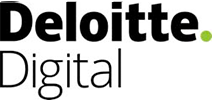

[](https://www.nuget.org/packages/DeloitteDigital.Atlas)

# Atlas - The Deloitte Digital Sitecore Framework
Atlas is the Deloitte Digital Framework for Sitecore Development. It consists of a collection of lightweight tools that can reduce development time and improve code quality in your CMS implementations.

The features in Atlas include:
- Sitecore ORM (maps Sitecore items to POCOs)
- Field Rendering (a clean, fluid syntax for Experience Editor enabled mapped fields)
- A structured approach to view renderings (adds consistency, reduces bugs)
- An implementation for dynamic placeholders
- Multi-site implementation helpers 

For a full list of features and documentation on each, refer to the [wiki section of this repository](https://github.com/DeloitteDigitalAPAC/Atlas/wiki). 

## Getting Started

### Install via Nuget

To install via [NuGet](https://www.nuget.org/), enter:

```
Install-Package DeloitteDigital.Atlas
```

Refer to the [Package page on NuGet](https://www.nuget.org/packages/DeloitteDigital.Atlas/) for details.

#### Usage

- Install the NuGet package as outlined above
- Enable the feature you want to use (refer to the [wiki](https://github.com/DeloitteDigitalAPAC/Atlas/wiki) for details) 

## Change log

`1.1.0` - 7 December 2017

* Replace CommonServiceLocator with n Sitecore.DependencyInjection.ServiceLocator - note that this now requires Sitecore 8.2+

`1.0.1` - 7 December 2017

* Add synchronisation around initial model mapping to resolve potential race condition ([issue #7](https://github.com/DeloitteDigitalAPAC/Atlas/issues/7))
* Remove usage of a SecurityDisabler within the GetFieldValueAsItem() extension method ([issue #11](https://github.com/DeloitteDigitalAPAC/Atlas/issues/11))
* Remove unnecessary logging ([issue #8](https://github.com/DeloitteDigitalAPAC/Atlas/issues/8))
* Remove LinkFieldStyle class from framework as it is not a particularly reusable component ([issue #2](https://github.com/DeloitteDigitalAPAC/Atlas/issues/2))

`1.0.0` - 23 November 2016

* Migrate from DSF (Deloitte Sitecore Framework) 1.3.8 hosted internally to GitHub as DeloitteDigital.Atlas.

## Want to contribute?

* Got an amazing idea to make Atlas better?
* Found an annoying bug?

Please don't hesitate to raise an issue through GitHub or open a pull request to show off your fancy pants coding skills - we'll really appreciate it! Questions or other feedback - get in touch with the team via atlas@deloitte.com.au.

## Who is Deloitte Digital?

**Part Business. Part Creative. Part Technology. One hundred per cent digital.**

Pioneered in Australia, Deloitte Digital is committed to helping clients unlock the business value of emerging technologies. We provide clients with a full suite of digital services, covering digital strategy, user experience, content, creative, engineering and implementation across mobile, web and social media channels.

[http://www.deloittedigital.com/au](http://www.deloittedigital.com/au)

## LICENSE (BSD-3-Clause)
[View License](LICENSE)
